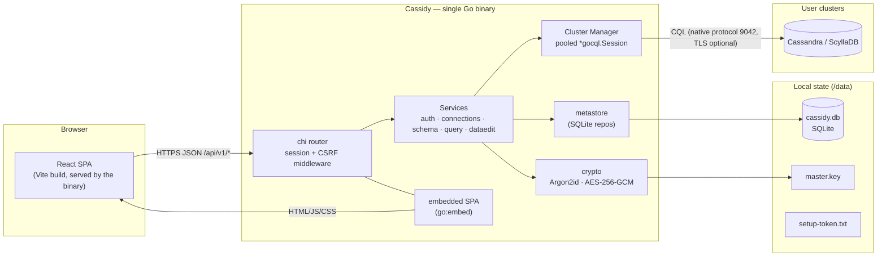
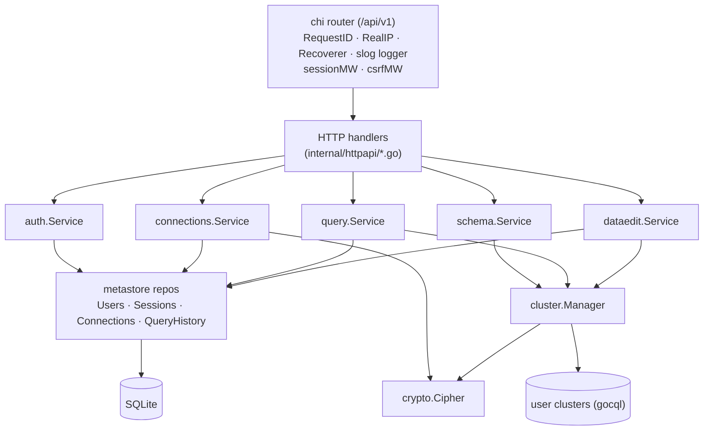
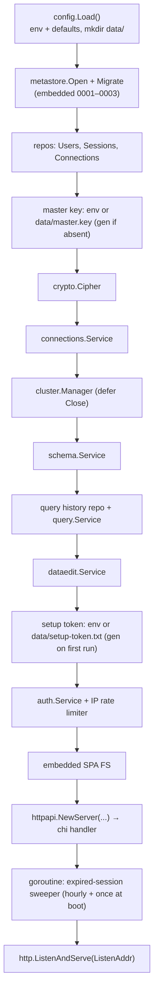
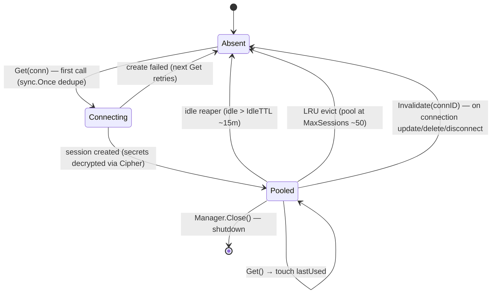
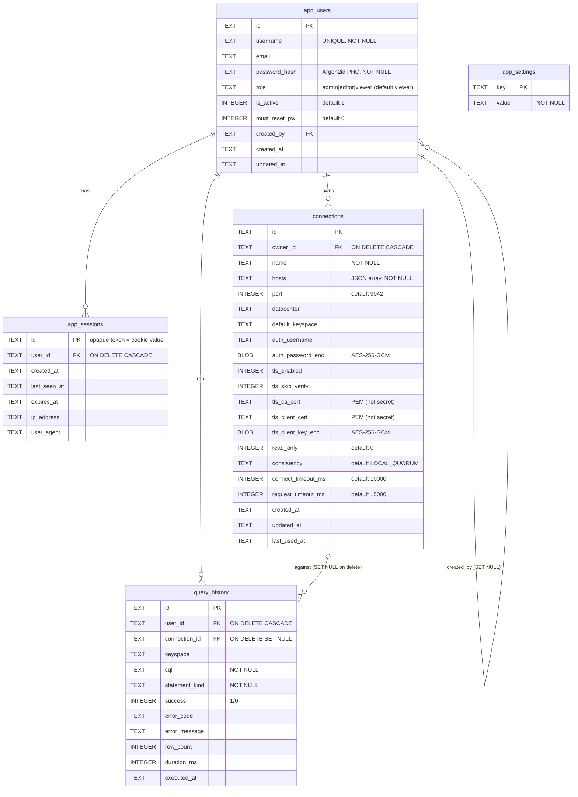
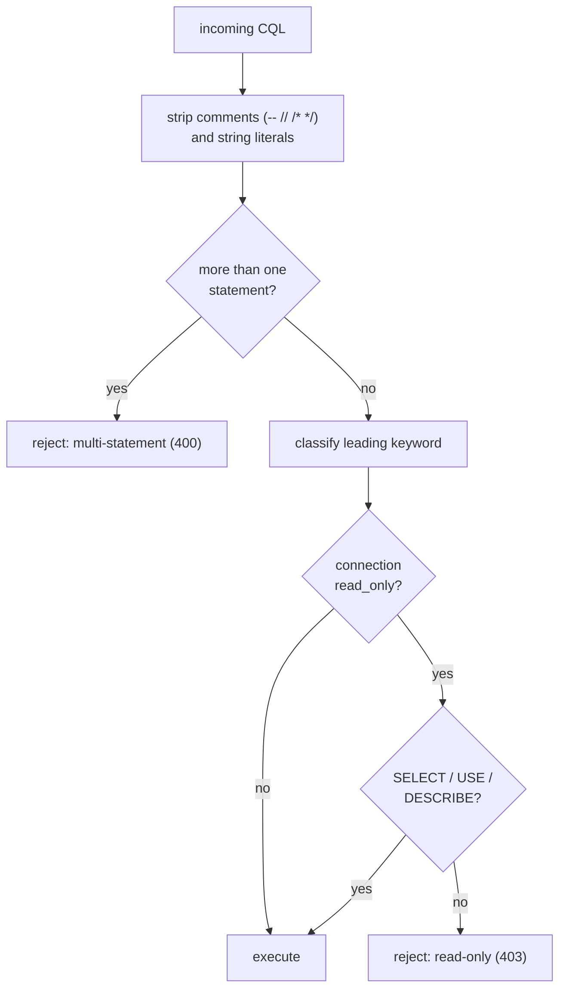
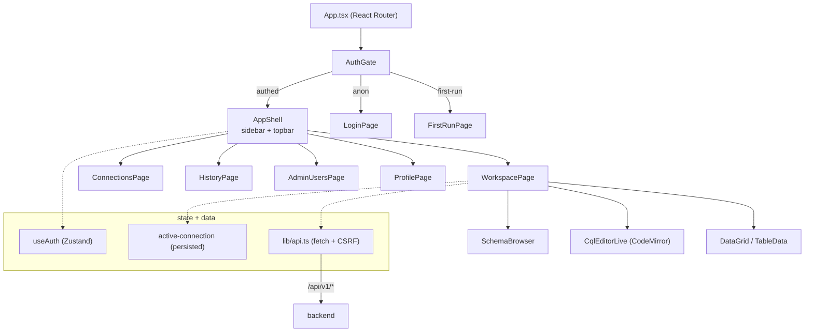
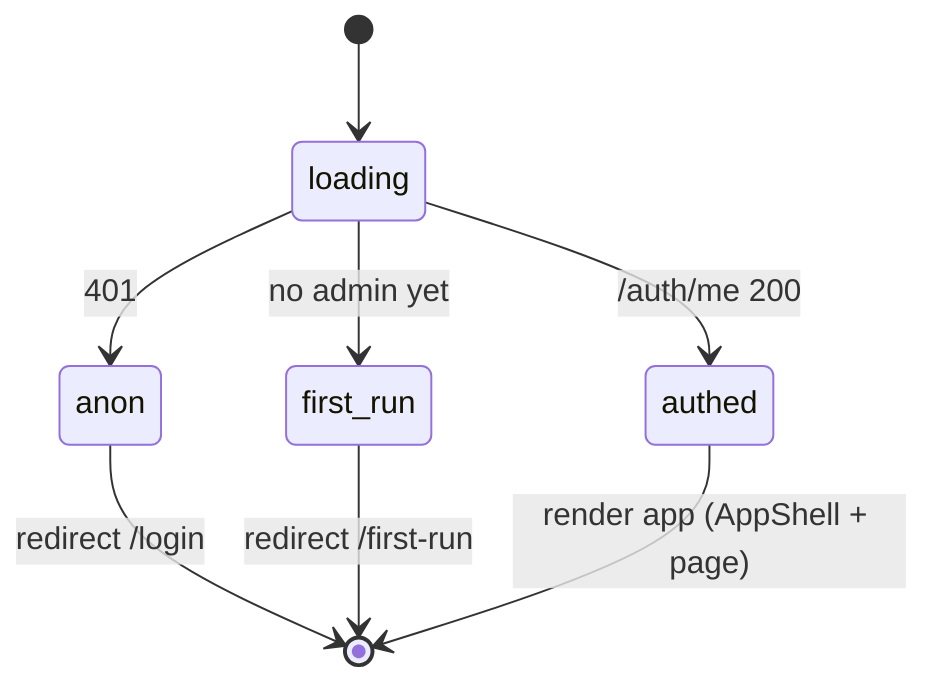
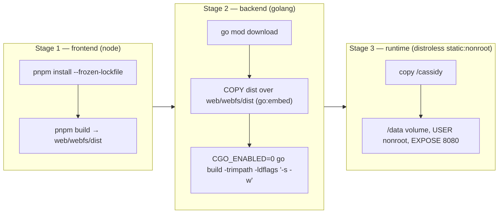

# Cassidy — System Design

This is the technical reference for **Cassidy**, a self-hostable, pgAdmin-style web GUI
for Apache Cassandra & ScyllaDB. It ships as a **single static (CGO-free) Go binary** with
the React UI embedded; you point it at your own cluster(s), and it serves a multi-user web
app for browsing schema, running CQL, and editing rows. This document explains *how the
system is built* — architecture, request lifecycle, data model, security, the REST API,
the frontend, and packaging.

For installation and day-to-day usage, see the [README](./README.md). Diagrams below are
[Mermaid](https://mermaid.js.org/) and render inline on GitHub.

---

## Table of contents

1. [Overview](#1-overview)
2. [High-level architecture](#2-high-level-architecture)
3. [Technology stack](#3-technology-stack)
4. [Repository layout](#4-repository-layout)
5. [Backend architecture](#5-backend-architecture)
6. [Request lifecycle](#6-request-lifecycle)
7. [Cluster connection management](#7-cluster-connection-management)
8. [Data model (SQLite metastore)](#8-data-model-sqlite-metastore)
9. [Security model](#9-security-model)
10. [REST API reference](#10-rest-api-reference)
11. [Frontend architecture](#11-frontend-architecture)
12. [Workspace deep-dive](#12-workspace-deep-dive)
13. [Build, packaging & deployment](#13-build-packaging--deployment)
14. [CI/CD](#14-cicd)
15. [Development setup](#15-development-setup)
16. [Post-MVP backlog](#16-post-mvp-backlog)

---

## 1. Overview

Cassidy is an internal-tool-grade admin console for Cassandra/ScyllaDB. A team runs **one**
Cassidy instance; users log in with local accounts and each keeps their own saved cluster
connections (with credentials encrypted at rest).

**Capabilities**

- **Connection manager** — per-user saved connections: contact points, port, datacenter,
  default keyspace, auth, TLS, consistency/timeouts, and a per-connection **read-only**
  toggle. Test before saving.
- **Schema browser** — keyspaces → tables → columns/indexes, with reconstructed
  `CREATE TABLE` DDL.
- **CQL query editor** — CodeMirror 6 with CQL syntax + schema-aware autocomplete, paged
  results, run-only-selected-text, CSV/JSON export.
- **Data browse & edit** — spreadsheet-style row editing that previews the exact
  `BEGIN BATCH … APPLY BATCH;` before committing.
- **Query history** — every executed statement, across all of a user's connections.
- **User admin & profile** — admin manages users/roles; users change password and revoke
  their own sessions.

**Design principles**

- **Single static binary + embedded SPA** — `CGO_ENABLED=0` Go binary with the built React
  app embedded via `go:embed`; ships as a tiny distroless image.
- **App metadata in embedded SQLite** — pure-Go `modernc.org/sqlite`, no external DB.
- **Security-first** — Argon2id passwords, server-side sessions, double-submit CSRF,
  per-IP login rate limiting, AES-256-GCM encryption of cluster secrets, and app-side
  read-only enforcement.
- **Bounded resource use** — pooled gocql sessions with idle reaping + LRU cap; mandatory
  paging on result sets.

---

## 2. High-level architecture



The browser talks to the binary over `/api/v1/*` (JSON) and is itself served by the binary
(the SPA is embedded). The binary keeps **application** state in local SQLite, and reaches
out to **user** clusters on demand via pooled gocql sessions.

---

## 3. Technology stack

**Backend (Go)**

| Concern | Choice |
|---|---|
| Language / build | Go, `CGO_ENABLED=0` static binary |
| HTTP router | `github.com/go-chi/chi/v5` |
| Cassandra driver | `github.com/apache/cassandra-gocql-driver/v2` |
| Metadata store | `modernc.org/sqlite` (pure-Go) + embedded SQL migrations |
| Passwords | Argon2id (`golang.org/x/crypto/argon2`) |
| Secret encryption | AES-256-GCM (stdlib `crypto/aes` + `crypto/cipher`) |
| SPA embedding | `embed` (`//go:embed all:dist`) |

**Frontend (TypeScript)**

| Concern | Choice |
|---|---|
| Build / dev | Vite |
| UI | React 18 + TypeScript |
| Styling | Tailwind CSS + shadcn/ui (new-york, dark-only, zinc) |
| Editor | CodeMirror 6 (`@codemirror/*`, `@uiw/react-codemirror`, `@codemirror/lang-sql`) |
| State | Zustand |
| Routing | React Router |
| Toasts / icons | sonner · lucide-react |
| Fonts | Geist (UI) · JetBrains Mono (CQL/data) |

---

## 4. Repository layout

```
cassandra-gui/
├── cmd/server/main.go            # entry point: config → migrate → wire → serve
├── internal/
│   ├── auth/                     # sessions, CSRF, login rate limit, setup token, service
│   ├── cluster/                  # gocql session pool (config, manager, session, tls)
│   ├── config/                   # env-var config loader + data-file paths
│   ├── connections/              # connection service + DTOs (secrets stripped)
│   ├── crypto/                   # Argon2id + AES-256-GCM + master-key bootstrap
│   ├── dataedit/                 # row edit: coerce, builder (safe DML), service, dto
│   ├── httpapi/                  # chi router + all HTTP handlers + error envelope
│   ├── metastore/                # SQLite open + migrations + repos
│   │   └── migrations/           # 0001_init, 0002_connections, 0003_query_history
│   ├── query/                    # classifier, marshal, completion, export, service
│   └── schema/                   # introspection, DDL reconstruction, cache, service
├── web/                          # React SPA
│   ├── src/{pages,components,lib,styles}
│   └── webfs/webfs.go            # //go:embed all:dist  → served by the binary
├── Dockerfile                    # 3-stage: frontend → backend → distroless
├── docker-compose.yml            # Cassidy + throwaway Cassandra (healthcheck gate)
├── .github/workflows/ci.yml      # gofmt/vet/test · pnpm build · docker build
├── Makefile                      # build / frontend / backend / test / docker targets
├── README.md                     # install + usage
└── DESIGN.md                     # this document
```

---

## 5. Backend architecture

The backend is a thin HTTP layer over a set of services. Handlers parse/validate, call a
service, and write a uniform JSON envelope. Services hold the business logic and depend on
three lower-level building blocks: the **Cluster Manager** (live cluster I/O), the
**metastore** (SQLite repos), and **crypto**.



**Package responsibilities**

| Package | Responsibility |
|---|---|
| `internal/httpapi` | chi router, all handlers, RBAC guards, `{error:{code,message}}` envelope, SPA fallback |
| `internal/auth` | login/logout/setup/change-pw, session middleware, CSRF, login rate limiter, setup token |
| `internal/connections` | connection validation, create/update/delete, `ConnectionDTO` (secrets stripped), ephemeral build for "test unsaved" |
| `internal/cluster` | `*gocql.ClusterConfig`/`*tls.Config` builders, pooled session **Manager**, `Test()` |
| `internal/schema` | introspect `system.local`/`system_schema.*`, reconstruct DDL, TTL cache |
| `internal/query` | statement classifier (read-only guard), row→JSON marshal, run, export, completion |
| `internal/dataedit` | JSON→CQL value coercion, safe parameterized INSERT/UPDATE/DELETE builder, BATCH commit |
| `internal/metastore` | DB open, embedded migrations, repos for users/sessions/connections/query_history |
| `internal/crypto` | Argon2id hashing, AES-256-GCM `Cipher`, master-key load-or-generate |
| `internal/config` | env-var config + `data/` file paths |

### Startup & wiring

`cmd/server/main.go` builds everything in dependency order, then serves:



---

## 6. Request lifecycle

Every `/api/v1/*` request passes through the session and CSRF middleware. The session
middleware *looks up* the current user (so handlers can read it from context); individual
route groups enforce whether a user/admin is *required*. Below: a CQL execution.

```mermaid
sequenceDiagram
    autonumber
    participant UI as SPA (workspace)
    participant R as chi router
    participant SM as sessionMW
    participant CW as csrfMW
    participant QS as query.Service
    participant CL as query.Classifier
    participant CM as cluster.Manager
    participant DB as Cassandra
    participant H as query_history (SQLite)

    UI->>R: POST /api/v1/connections/{id}/query<br/>(cookie cassidy_session, header X-CSRF-Token)
    R->>SM: resolve session → user in ctx
    SM->>CW: double-submit CSRF check (header == cassidy_csrf cookie)
    CW->>QS: handler → Run(ctx, user, connID, req)
    QS->>QS: load owner-scoped connection (403 if not owner)
    QS->>CL: Classify(cql) — strip comments/strings, reject multi-statement
    CL-->>QS: kind (SELECT/…); block writes if connection is read-only (403)
    QS->>CM: GetSession(conn) — pooled *gocql.Session (lazy create)
    CM->>DB: execute with PageSize + PageState, per-request timeout
    DB-->>CM: rows + next page state + warnings
    CM-->>QS: iterator
    QS->>QS: marshal rows → JSON, base64 next page state
    QS-)H: async write history record (success/err, rows, duration)
    QS-->>UI: 200 { columns, rows, next_page_state, warnings, statement_kind }
```

Notes:

- **Paging** is mandatory: requests carry `page_size` and an opaque base64 `page_state`;
  one page is returned per call (no driver auto-prefetch), bounding memory.
- **Timeouts**: per-connection `request_timeout_ms` → gocql timeout + `context.WithTimeout`.
- **DDL** (`CREATE/ALTER/DROP/TRUNCATE`) invalidates the schema cache so the tree refreshes.
- **History** is written for every attempt, success or failure.

---

## 7. Cluster connection management

`cluster.Manager` keeps at most one live `*gocql.Session` per saved connection, created
lazily and reclaimed automatically.



- **Lazy + deduplicated**: concurrent first-`Get`s for the same connection collapse via
  `sync.Once`, so only one session is created.
- **Idle reaper**: a background loop (reap interval ~5m) closes sessions idle past `IdleTTL`.
- **LRU cap**: when the pool reaches `MaxSessions`, the least-recently-used session is
  evicted before adding a new one.
- **Invalidate**: editing/deleting a connection (or an explicit "disconnect") closes and
  removes the pooled session so the next `Get` rebuilds with current config; the schema
  cache for that connection is invalidated too.
- **Test**: `Test()` builds a throwaway session, runs `SELECT … FROM system.local`, reports
  cluster name / version / nodes-up / latency, and discards it — used by the connection
  form's "Test connection" for both saved and unsaved configs.
- **Testability**: a `SessionFactory` seam lets unit tests inject fake sessions.

Key methods: `Get`, `GetSession` (typed `*gocql.Session`), `Test`, `Invalidate`,
`Status` (`{Pooled, LastUsedAt}`), `Close`.

---

## 8. Data model (SQLite metastore)

Application metadata lives in `data/cassidy.db`. Schema is applied at boot from **embedded
migrations** (`0001_init`, `0002_connections`, `0003_query_history`); a `schema_migrations`
table records the applied version.



**Notes**

- **Encrypted at rest** (AES-256-GCM blobs, `nonce‖ciphertext‖tag`): `auth_password_enc`,
  `tls_client_key_enc`. CA/client *certs* are PEM and not secret. `hosts` is a JSON array.
- **Indexes**: `app_users(is_active)`; `app_sessions(user_id)`, `(expires_at)`;
  `connections(owner_id, name)`; `query_history(user_id, executed_at DESC)`,
  `(connection_id)`.
- **Cascades**: deleting a user cascades to their sessions, connections, and history;
  deleting a connection nulls the `connection_id` on history rows (the record of what was
  run is kept).
- **`app_settings`** exists for future runtime settings; it is currently unused.

---

## 9. Security model

```mermaid
sequenceDiagram
    autonumber
    participant UI as SPA
    participant S as auth.Service
    participant DB as SQLite

    UI->>S: POST /api/v1/auth/login {username, password}<br/>(rate-limited per IP; CSRF-exempt)
    S->>DB: load app_users by username
    S->>S: Argon2id verify (constant-time)
    S->>DB: insert app_sessions row (opaque token)
    S-->>UI: Set-Cookie cassidy_session (HttpOnly)<br/>Set-Cookie cassidy_csrf (readable)
    Note over UI: SPA reads cassidy_csrf and sends it as X-CSRF-Token on writes
    UI->>S: POST /api/v1/... (cookie + X-CSRF-Token)
    S->>S: sessionMW resolves user; csrfMW checks header == cookie
    S-->>UI: authorized response
```

- **Password hashing** — Argon2id, parameters `t=3`, `m=64 MiB`, `p=2`, key length `32`,
  salt `16`, stored in PHC string format (`$argon2id$v=19$m=65536,t=3,p=2$<salt>$<hash>`).
- **Sessions** — opaque random token stored in `app_sessions`, delivered as the
  **HttpOnly** `cassidy_session` cookie. Absolute TTL (`CASSIDY_SESSION_TTL`, default 30d)
  and idle TTL (`CASSIDY_SESSION_IDLE_TTL`, default 7d). An hourly background sweeper deletes
  expired sessions (plus one pass at boot).
- **CSRF** — double-submit cookie: a readable `cassidy_csrf` cookie whose value must match
  the `X-CSRF-Token` header on every non-safe request (constant-time compare). `auth/login`
  and `auth/setup` are exempt (no session yet).
- **Login rate limiting** — per-IP token bucket (`CASSIDY_LOGIN_RATE_LIMIT` attempts per
  `CASSIDY_LOGIN_RATE_WINDOW`, default 5 / 15m); returns `429` with `Retry-After`. Client IP
  is taken from `X-Forwarded-For`/`RemoteAddr` (chi `RealIP`).
- **First-run setup token** — on first boot with no admin, Cassidy generates a
  `cs_setup_…` token (printed to logs / written to `data/setup-token.txt`). It's required
  once at `/auth/setup` to claim the admin account, verified constant-time, then consumed.
- **Secret encryption** — a 32-byte **master key** (from `CASSIDY_MASTER_KEY` base64, else
  `data/master.key`, auto-generated `0600` if absent) drives AES-256-GCM encryption of
  connection secrets. Secrets are never returned in DTOs or logged. **Losing the master key
  makes saved cluster credentials unrecoverable — back it up with the database.**
- **RBAC** — roles `admin` / `editor` / `viewer`. User-management routes require `admin`
  (`RequireUser` + `RequireAdmin` middleware). Connections and their data are owner-scoped.

### Read-only enforcement & safe DML

Writes are blocked app-side on read-only connections, and inline row edits are built safely.



- The **classifier** (`internal/query/classifier.go`) strips comments and strings first so
  keywords inside them don't cause false positives, rejects payloads containing more than
  one statement, and marks `SELECT/USE/DESCRIBE` as read-only and
  `CREATE/ALTER/DROP/TRUNCATE` as DDL (which also triggers schema-cache invalidation).
- The **data-edit builder** (`internal/dataedit/builder.go`) requires a value for **every**
  partition + clustering key column (`ErrIncompletePK`), refuses counter and
  collection/tuple/frozen columns for inline editing, and emits **parameterized** CQL
  (`?` placeholders) — committed as a single `LoggedBatch`. The UI previews the exact BATCH
  text before commit.

---

## 10. REST API reference

Base path `/api/v1`. Responses use a uniform error envelope `{"error":{"code","message"}}`;
auth state is also signaled via `first_run` where relevant. Non-safe methods (POST/PUT/
PATCH/DELETE) require the CSRF header except where noted. Health/version live at the root.

**System / public**

| Method | Path | Auth | Notes |
|---|---|---|---|
| GET | `/healthz` | – | liveness `{status:"ok"}` |
| GET | `/version` | – | `{version}` |
| POST | `/api/v1/auth/login` | – | rate-limited; **CSRF-exempt** |
| POST | `/api/v1/auth/setup` | – | first-run admin claim; rate-limited; **CSRF-exempt** |
| GET | `/api/v1/auth/me` | optional | current user, or `401` if anonymous |

**Auth & sessions** (authenticated)

| Method | Path | Notes |
|---|---|---|
| POST | `/api/v1/auth/logout` | revoke current session |
| POST | `/api/v1/auth/change-password` | self password change |
| GET | `/api/v1/users/{id}/sessions` | list a user's sessions |
| DELETE | `/api/v1/sessions/{id}` | revoke a session |

**Connections** (authenticated, owner-scoped)

| Method | Path | Notes |
|---|---|---|
| GET | `/api/v1/connections` | list own connections |
| POST | `/api/v1/connections` | create |
| POST | `/api/v1/connections/test` | test an **unsaved** config |
| GET | `/api/v1/connections/{id}` | get one |
| PUT | `/api/v1/connections/{id}` | update (invalidates pool + schema cache) |
| DELETE | `/api/v1/connections/{id}` | delete |
| POST | `/api/v1/connections/{id}/test` | test a **saved** connection |
| POST | `/api/v1/connections/{id}/disconnect` | close pooled session |
| GET | `/api/v1/connections/{id}/status` | `{pooled, last_used_at}` |

**Schema** (authenticated)

| Method | Path | Notes |
|---|---|---|
| GET | `/api/v1/connections/{id}/cluster-info` | cluster name/version/peers |
| GET | `/api/v1/connections/{id}/keyspaces` | list keyspaces |
| GET | `/api/v1/connections/{id}/keyspaces/{ks}/tables` | list tables |
| GET | `/api/v1/connections/{id}/keyspaces/{ks}/tables/{t}` | table detail (columns/indexes/props) |
| GET | `/api/v1/connections/{id}/keyspaces/{ks}/tables/{t}/ddl` | reconstructed `CREATE TABLE` |
| GET | `/api/v1/connections/{id}/keyspaces/{ks}/types` | user-defined types |

**Query & history** (authenticated)

| Method | Path | Notes |
|---|---|---|
| POST | `/api/v1/connections/{id}/query` | run CQL (paged); read-only guard applies |
| POST | `/api/v1/connections/{id}/query/export` | stream CSV/NDJSON |
| GET | `/api/v1/connections/{id}/completion` | autocomplete suggestions |
| GET | `/api/v1/query-history` | list (filters: `connection_id`, `kind`, `success`, `limit`, `before`) |
| DELETE | `/api/v1/query-history/{id}` | delete one history entry |

**Data browse & edit** (authenticated)

| Method | Path | Notes |
|---|---|---|
| GET | `/api/v1/connections/{id}/keyspaces/{ks}/tables/{t}/rows` | paged `SELECT *` + editability flags |
| POST | `/api/v1/connections/{id}/keyspaces/{ks}/tables/{t}/rows/preview` | preview the generated BATCH |
| POST | `/api/v1/connections/{id}/keyspaces/{ks}/tables/{t}/rows/commit` | commit the BATCH (read-only → 403) |

**Admin** (authenticated + `admin` role)

| Method | Path | Notes |
|---|---|---|
| GET | `/api/v1/users` | list users |
| POST | `/api/v1/users` | invite/create user |
| PATCH | `/api/v1/users/{id}` | update role/email/active |
| DELETE | `/api/v1/users/{id}` | deactivate/delete user |
| POST | `/api/v1/users/{id}/reset-password` | reset a user's password |

Any unmatched `/api/*` returns `404 {error:{code:"not_found"}}`; all other paths fall
through to the embedded SPA.

---

## 11. Frontend architecture

A single-page React app, built by Vite into `web/webfs/dist` and embedded into the binary.
Routes are gated by `AuthGate`; authenticated pages render inside `AppShell` (sidebar +
topbar). State lives in Zustand stores and is fetched through a small typed `api` client.



### Routing & the auth gate

`AuthGate` calls `/auth/me` on mount and renders based on auth status:



Routes: `/login`, `/first-run` (public); `/` & `/workspace`, `/connections`, `/history`,
`/admin/users`, `/profile`, `/home`, and a catch-all (all wrapped in `AuthGate`).

### Pages

| Page | Purpose |
|---|---|
| `login.tsx` (`LoginPage`, `FirstRunPage`) | sign in; first-run admin setup via token |
| `connections.tsx` | list / create / edit / test connections |
| `workspace.tsx` | the main query + data + schema workspace |
| `history.tsx` | all of the user's queries; filter, copy, re-open in workspace |
| `admin-users.tsx` | admin user list, roles, invite |
| `profile.tsx` | change password, manage active sessions |

### Key components

| Component | Purpose |
|---|---|
| `app-shell.tsx` | sidebar nav + topbar (connection pill, user menu) |
| `schema-browser.tsx` | lazy keyspace→table→column tree with per-keyspace load state |
| `cql-editor-live.tsx` | CodeMirror 6 CQL editor: dark theme, autocomplete, ⌘↵ run, selection reporting |
| `data-grid.tsx` | virtualized result/edit grid; PK/CK markers; locked cells; sticky header |
| `table-data.tsx` | data-edit tab: dirty buffer, add/delete rows, preview→commit |
| `confirm-cql-dialog.tsx` | danger dialog rendering the BATCH + tombstone warning + "I understand" gate |
| `connection-form.tsx` | connection create/edit form (hosts chips, TLS, auth, advanced) |
| `cql-highlight.tsx` | static CQL syntax renderer (DDL preview, BATCH preview) |
| `primitives.tsx` | `StatusDot`, `Kbd`, `Spinner`, `Skeleton` |
| `components/ui/*` | shadcn primitives (button, card, input, select, dialog, badge, …) |

### State management (Zustand, `web/src/lib`)

- **`auth-store.ts`** — `useAuth`: `{ status, user, error }` + actions `loadMe`, `login`,
  `logout`, `setup`. `User = { id, username, email?, role, is_active, must_reset_pw,
  created_at }`; `AuthStatus = loading | anon | first-run | authed`.
- **`active-connection.ts`** — `{ activeId, setActive }`, persisted to localStorage
  (`cassidy.activeConnection`) so the selected connection survives reloads.
- **`active-connection-data.ts`** — `useActiveConnectionDetail()` hook: fetches the full
  `ConnectionDTO` for `activeId`, clears the selection on `404`, exposes `{ status, conn,
  error, reload }`.

### API client (`web/src/lib/api.ts`)

```ts
export async function api<T>(path: string, opts: RequestOpts = {}): Promise<T> {
  const method = (opts.method ?? "GET").toUpperCase();
  const headers: Record<string, string> = {};
  if (opts.body !== undefined) headers["Content-Type"] = "application/json";
  if (!SAFE_METHODS.has(method)) {
    const csrf = readCookie("cassidy_csrf");
    if (csrf) headers["X-CSRF-Token"] = csrf;   // double-submit token
  }
  const res = await fetch(`/api/v1${path}`, { method, credentials: "include", headers,
    body: opts.body !== undefined ? JSON.stringify(opts.body) : undefined, signal: opts.signal });
  // …throws APIError(status, code, message, firstRun?) on non-2xx
}
```

All requests are same-origin with `credentials:"include"`; the CSRF cookie is echoed into
the `X-CSRF-Token` header for writes; errors surface as a typed `APIError`.

### Feature libs

| Module | Exposes |
|---|---|
| `connections.ts` | `ConnectionDTO` + CRUD/test/status calls |
| `schema.ts` | cluster-info/keyspaces/tables/table/ddl/types + types |
| `query.ts` | `runQuery`, `exportQuery`, `listHistory`, `deleteHistory`, `getCompletion`, `HistoryEntry` |
| `dataedit.ts` | `getRows`, `previewChanges`, `commitChanges`, changeset types |
| `cql-language.ts` | CodeMirror CQL dialect + schema-aware completion source |

### localStorage keys

| Key | Stores |
|---|---|
| `cassidy.activeConnection` | the selected connection id (Zustand persist) |
| `cassidy.tabs:{connId}` | open query/data tabs + cached results + active tab, per connection |
| `cassidy.schema:{connId}` | schema-tree expansion + selected table + cached detail, per connection |

### Design system

`web/src/styles/globals.css` is a verbatim port of the design handoff tokens: **dark-only**,
zinc neutrals, `--radius: 0.3rem`, compact density (13px base). Beyond stock shadcn it adds
`--success/--warning/--info/--panel/--panel-2/--border-strong`, CQL syntax token classes
(`.tk-kw`, `.tk-type`, `.tk-str`, …), and PK/CK pill colors. Geist for UI, JetBrains Mono
for CQL and data.

---

## 12. Workspace deep-dive

The workspace is a multi-tab environment over one active connection.

- **Tabs** are either **query** tabs (a CQL buffer + result grid + paging stack) or **data**
  tabs (the editable `TableData` view for one table). Tabs, their results, and the schema
  tree are persisted per connection (see localStorage keys), so a refresh restores the
  session.
- **Run selection** — if text is highlighted in the editor, Run / ⌘↵ executes only that
  selection; otherwise the whole tab. The actually-executed statement is remembered per tab
  (`runCql`) so **paging** continues the right statement (important since multi-statement
  buffers are rejected by the backend).
- **Schema browser** lazily loads keyspaces → tables → columns and feeds the editor's
  autocomplete.
- **"View 100"** opens a `SELECT * FROM ks.tbl LIMIT 100` query tab and runs it (pgAdmin
  style); **"Edit"** opens the editable data tab.

The data-edit flow always previews the generated CQL before touching the cluster:

```mermaid
sequenceDiagram
    autonumber
    participant UI as TableData (grid)
    participant DE as dataedit.Service
    participant DB as Cassandra
    participant H as query_history

    UI->>UI: user edits cells / adds / deletes rows (dirty buffer)
    UI->>DE: POST …/rows/preview { changeset }
    DE->>DE: coerce JSON→CQL, validate full PK, reject counters/collections
    DE-->>UI: BEGIN BATCH … APPLY BATCH; (display text) + delete count
    UI->>UI: confirm dialog (tombstone warning + "I understand")
    UI->>DE: POST …/rows/commit { changeset }
    DE->>DE: read-only guard (403 if connection is read-only)
    DE->>DB: LoggedBatch (parameterized)
    DB-->>DE: applied
    DE-)H: history record
    DE-->>UI: 200 committed
```

---

## 13. Build, packaging & deployment

A 3-stage Docker build produces a small distroless image with only the static binary.



- **SPA embed** — `web/webfs/webfs.go` declares `//go:embed all:dist`; the backend stage
  overlays the freshly built `dist/` before `go build`, so the binary serves the real UI.
  Non-`/api` requests fall back to `index.html` (client-side routing).
- **`docker-compose.yml`** brings up Cassidy plus a throwaway `cassandra:5` with a CQL
  healthcheck gate; inside compose, add a connection to host `cassandra` port `9042`.
- **`/data` volume** holds `cassidy.db`, `master.key`, `setup-token.txt`. A named volume
  inherits writable ownership for the non-root uid; host bind-mounts must be chowned to
  uid `65532`.

### Environment variables

| Variable | Default | Purpose |
|---|---|---|
| `CASSIDY_LISTEN_ADDR` | `:8080` | HTTP bind address |
| `CASSIDY_DATA_DIR` | `./data` | dir for SQLite DB, master key, setup token |
| `CASSIDY_MASTER_KEY` | *(empty)* | base64 32-byte key; if unset, uses/creates `data/master.key` |
| `CASSIDY_SETUP_TOKEN` | *(empty)* | first-run token; if unset, uses/creates `data/setup-token.txt` |
| `CASSIDY_COOKIE_DOMAIN` | *(empty)* | cookie domain |
| `CASSIDY_COOKIE_SECURE` | `false` | set `Secure` on cookies (enable behind HTTPS) |
| `CASSIDY_SESSION_TTL` | `720h` (30d) | absolute session lifetime |
| `CASSIDY_SESSION_IDLE_TTL` | `168h` (7d) | idle session lifetime |
| `CASSIDY_LOGIN_RATE_LIMIT` | `5` | login attempts per window per IP |
| `CASSIDY_LOGIN_RATE_WINDOW` | `15m` | rate-limit window |

### First run & operations

1. Start the container; the logs print a one-time **setup token**.
2. Open `/first-run`, enter the token + admin username/email/password.
3. Add a connection, test it, and start querying.
4. **Back up `data/master.key`** alongside the database — without it, saved cluster
   credentials cannot be decrypted. Set `CASSIDY_COOKIE_SECURE=true` behind TLS.

Migrations apply automatically on boot; the image is the unit of upgrade (back up `data/`
first).

---

## 14. CI/CD

`.github/workflows/ci.yml` runs on push/PR (parallel jobs):

- **backend** — `gofmt` gate (`test -z "$(gofmt -l .)"`), `go vet ./...`, `go test ./...`,
  then a static build and a `file … | grep 'statically linked'` assertion (the committed
  `web/webfs/dist/.gitkeep` lets `//go:embed all:dist` compile without a frontend build).
- **frontend** — `pnpm install --frozen-lockfile` + `pnpm build` (runs `tsc -b` typecheck +
  Vite build).
- **docker** — full multi-stage image build (loaded locally), then a smoke check
  (`/healthz` → 200, setup token present in logs).

Cluster-touching integration tests are build-tagged and excluded from CI (no Cassandra
service); the safety-critical logic (classifier, builder, crypto, marshalling) is covered by
unit tests.

---

## 15. Development setup

```sh
# Backend (serves embedded SPA if web/webfs/dist is built)
make build           # frontend → backend; or:
make backend         # CGO_ENABLED=0 go build -ldflags '-s -w' -o dist/cassidy ./cmd/server
CASSIDY_LISTEN_ADDR=:8080 CASSIDY_DATA_DIR=./data ./dist/cassidy

# Frontend dev (hot reload; proxies /api → :8080)
cd web && pnpm install && pnpm dev

# Tests
go test ./...
```

`make` targets: `build`, `frontend`, `backend`, `test`, `tidy`, `fmt`, `docker`,
`compose`, `docker-run`. The Vite dev server proxies `/api` to `http://localhost:8080`, so
run the binary alongside `pnpm dev` for a full local stack. For local cluster access, point
a connection at reachable contact points (e.g. a `docker run cassandra:5`, or VPN-reachable
internal IPs when running the native binary).

---

## 16. Post-MVP backlog

- Connection sharing across users (`connection_shares`).
- SSO / OIDC login.
- Cassandra-side role/permission viewer.
- Saved / favorite queries.
- Audit log of DML/DDL run through the app.
- Runtime settings UI backed by `app_settings` (a `/settings` page).
- Shard-aware `scylladb/gocql` driver option.
- Command palette (`⌘K`) and fuller keyboard navigation.
