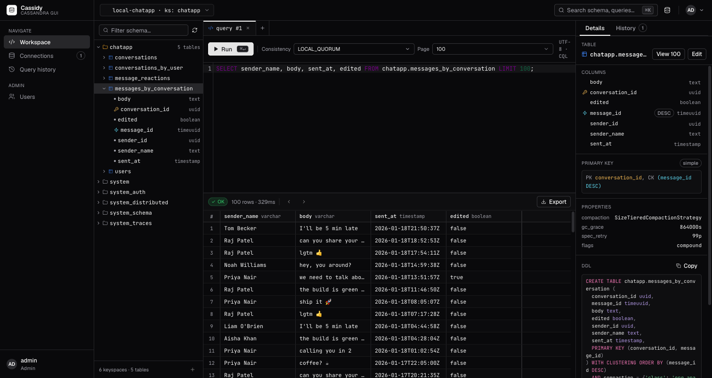

# Cassidy — self-hostable web GUI for Cassandra



Cassidy is a pgAdmin-style web GUI for Apache Cassandra & ScyllaDB. It ships as a
**single static Go binary** with the React UI embedded — point it at your own
cluster, browse the schema, run CQL, and edit rows. Multi-user with local
accounts; each user keeps their own saved connections (credentials encrypted at
rest). Dark, compact, keyboard-friendly.

Features: connection manager (TLS, auth, per-connection read-only toggle) ·
schema browser with reconstructed DDL · CodeMirror CQL editor with schema-aware
autocomplete, paging, CSV/JSON export, and query history · spreadsheet-style row
editing that previews the exact `BEGIN BATCH … APPLY BATCH;` before committing.

## Contents

- [Quick start (Docker)](#quick-start-docker)
  - [Try it with a throwaway Cassandra](#try-it-with-a-throwaway-cassandra)
- [First run](#first-run)
- [Connecting to Cassandra](#connecting-to-cassandra)
  - [Networking: VPN-routed or host-local clusters](#networking-vpn-routed-or-host-local-clusters)
- [Environment variables](#environment-variables)
- [⚠ Back up your master key](#-back-up-your-master-key)
- [Upgrading](#upgrading)
- [Build from source](#build-from-source)
- [Architecture](#architecture)
- [Set up locally with an AI coding agent](#set-up-locally-with-an-ai-coding-agent)

## Quick start (Docker)

```sh
docker run -p 8080:8080 -v cassidy-data:/data ghcr.io/ashikkabeer/cassidy:latest
# or build locally:  docker build -t cassidy . && docker run -p 8080:8080 -v cassidy-data:/data cassidy
```

Open <http://localhost:8080>. On first run Cassidy prints a one-time **setup
token** to its logs — use it to claim the admin account (see [First run](#first-run)).

> The `-v cassidy-data:/data` volume holds the SQLite metadata DB **and the
> master key**. Keep it — see [Back up your master key](#back-up-your-master-key).

### Try it with a throwaway Cassandra

```sh
docker compose up --build
```

This starts Cassidy plus a local `cassandra:5` and waits for it to be healthy.
Open <http://localhost:8080>, claim the admin, then add a connection with host
**`cassandra`**, port **`9042`** (no auth, no TLS). If port 8080 is taken on your
host, run `CASSIDY_PORT=8088 docker compose up`.

## First run

Cassidy bootstraps the first admin with a one-time token (so a fresh deployment
isn't world-open):

```sh
docker logs <container>     # or: docker compose logs cassidy
# … "first-run setup pending … setup_token": "cs_setup_…"
```

Go to `/first-run`, paste the token, and create the admin username + password.
The token is consumed on success. (You can also pre-set it with
`CASSIDY_SETUP_TOKEN`.)

## Connecting to Cassandra

Connections are added in the UI (Connections → New connection), not via config —
each is owned by the user who created it, and the auth password / TLS client key
are encrypted at rest with the master key. Reference tables as
`keyspace.table` in the query editor. Flip a connection to **read-only** to block
all INSERT/UPDATE/DELETE/DDL through the UI (note: this is an app-layer guard —
real protection still needs Cassandra-side `GRANT`s).

### Networking: VPN-routed or host-local clusters

Cassidy reaches your cluster from **wherever the Cassidy process runs**, not from
your browser. That matters when your cluster is only reachable over a VPN or sits
on the host's `localhost`: a contact point like `10.10.1.26` must be routable from
inside the container, and **Docker Desktop on macOS/Windows runs containers in a
Linux VM that does not inherit your host's VPN routes** — so VPN-only internal IPs
typically fail to connect there.

| Cassidy runs as… | VPN-only internal IPs (e.g. `10.10.1.26`) | Cassandra on the host's own `localhost` |
|---|---|---|
| **Native binary** on your machine | ✅ uses your machine's routes/VPN | ✅ `127.0.0.1` |
| **Docker Desktop** (macOS/Windows) | ❌ usually fails (VM can't see the VPN) | use `host.docker.internal`, not `localhost` |
| **Docker on Linux** with `--network host` | ✅ shares host routes (incl. VPN) | ✅ `127.0.0.1` |
| **docker-compose** (own bridge network) | ❌ for VPN IPs | use the service name (e.g. `cassandra`) |

Rules of thumb: if your cluster is reachable **only via a VPN on your machine**, run
the **native binary** (`make build` → `./dist/cassidy`). Use Docker when Cassidy and
the cluster are co-located — same Docker network (compose), the same Linux host
(`--network host`), or a publicly routable address.

## Environment variables

| Variable | Default | Purpose |
|---|---|---|
| `CASSIDY_LISTEN_ADDR` | `:8080` | HTTP listen address |
| `CASSIDY_DATA_DIR` | `/data` (image) · `./data` (binary) | SQLite DB, master key, setup token |
| `CASSIDY_MASTER_KEY` | — | Base64 32-byte key for encrypting Cassandra creds. If unset, generated into `data/master.key` |
| `CASSIDY_SETUP_TOKEN` | — | Pre-set the first-run token instead of auto-generating |
| `CASSIDY_COOKIE_SECURE` | `false` | Set `true` when serving over HTTPS (adds `Secure` to cookies) |
| `CASSIDY_COOKIE_DOMAIN` | — | Optional cookie domain |
| `CASSIDY_SESSION_TTL` | `720h` | Session lifetime |
| `CASSIDY_SESSION_IDLE_TTL` | `168h` | Idle session lifetime |
| `CASSIDY_LOGIN_RATE_LIMIT` | `5` | Login attempts per window per IP |
| `CASSIDY_LOGIN_RATE_WINDOW` | `15m` | Login rate-limit window |

## ⚠ Back up your master key

`data/master.key` encrypts every saved Cassandra password and TLS client key.
**If you lose it, those secrets are unrecoverable** — you'll have to re-enter
each connection's credentials. Back up the whole `data/` directory (or pin the
key via `CASSIDY_MASTER_KEY` and store it in your secret manager).

When running with a **host bind-mount** instead of a named volume, the image runs
as non-root (uid `65532`), so the mounted directory must be writable by it:
`chown 65532:65532 /path/to/data`. Named volumes (incl. docker-compose) handle
this automatically.

## Upgrading

Pull the new image and restart — schema migrations apply automatically on boot
and are forward-only. Always back up `data/` first. The image is the unit of
upgrade; no separate migration step.

## Build from source

Requires Go 1.25+, Node 22+, and pnpm.

```sh
make build      # builds the frontend, then the static binary → dist/cassidy
make test       # go test ./...
make docker     # docker build -t cassidy:dev .
make compose    # docker compose up --build
make dev        # Vite dev server + go run, with /api proxied
```

The binary is fully self-contained (`CGO_ENABLED=0`, pure-Go SQLite) — copy
`dist/cassidy` anywhere and run it.

## Architecture

Go backend (chi router → `auth` / `connections` / `schema` / `query` / `dataedit`
services → a pooled-`gocql.Session` Cluster Manager) with metadata in embedded
SQLite. React + Tailwind + shadcn/ui frontend, embedded via `go:embed`. The
`apache/cassandra-gocql-driver/v2` driver talks to your clusters; ScyllaDB works
too (same CQL protocol).

For the full system documentation — architecture, request lifecycle, data model,
security model, REST API reference, frontend internals, and packaging (with
diagrams) — see **[DESIGN.md](./DESIGN.md)**.

## Set up locally with an AI coding agent

Paste this into Claude Code (or any AI agent) from the repo root:

```text
Set up "Cassidy" (this repo — a self-hostable web GUI for Cassandra/ScyllaDB)
locally. Read README.md + DESIGN.md, then ASK ME before running anything:

1. Run mode: native binary (best for dev / VPN clusters) · Docker · docker-compose
   (with a throwaway Cassandra) · dev hot-reload (`make dev`)?
2. Cluster: existing (give contact points + port) or spin up a throwaway one?
3. Reachability: VPN-only internal IPs · host localhost · public/same-Docker-net?
   (VPN-only ⇒ use the NATIVE binary; Docker Desktop can't see VPN routes.)
4. Cluster auth: username/password? TLS / CA / client cert?
5. HTTP port (default 8080; else set CASSIDY_LISTEN_ADDR=:PORT).

Then, per my answers: check prereqs (Go 1.25+, Node 22 + pnpm, Docker) and offer
to install missing ones; build/run via the Makefile (native: `make build` →
`CASSIDY_LISTEN_ADDR=:PORT CASSIDY_DATA_DIR=./data ./dist/cassidy`; `make docker`
/ `make compose` / `make dev`; in compose use host `cassandra:9042`); wait for
`GET /healthz` = 200; get the one-time SETUP TOKEN from the logs and walk me
through /first-run; then help me add the connection, Test, and run a query.
Remind me to back up `data/master.key` and set CASSIDY_COOKIE_SECURE=true behind
HTTPS. Never commit secrets or `data/`; if a build fails, fix the root cause.
```
